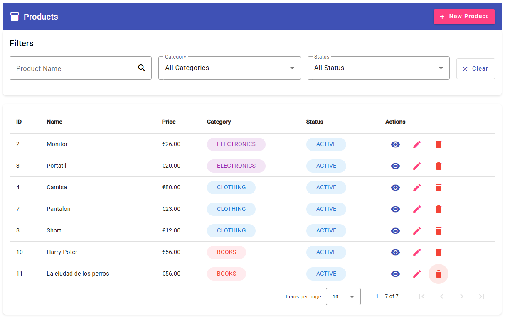

# Product UI

Frontend application for managing products built with Angular 20.

## 📸 Application Interface




The application features a clean, modern interface built with **Angular Material**, providing:
- **Header Bar**: Application title and "New Product" button for quick access
- **Advanced Filters**: Search by product name, category, and status
- **Data Table**: Comprehensive product listing with pagination
- **Status Chips**: Color-coded status indicators (Active/Inactive)
- **Category Chips**: Visual category identification (Electronics, Clothing, Books)
- **Action Buttons**: View, Edit, and Delete operations for each product
- **Responsive Design**: Optimized for both desktop and mobile devices

## Prerequisites

- Node.js (v18 or higher)
- npm (v9 or higher)
- Angular CLI (v20 or higher)

## Setup

1. Clone the repository:
```bash
git clone <your-repository-url>
cd product-ui
```

2. Install dependencies:
```bash
npm install
```

3. Configure environment:
   Update `src/environments/environment.ts` with your backend API URL:
   ```typescript
   export const environment = {
     production: false,
     apiUrl: 'https://your-backend-api.com/api'
   };
   ```

## Development

Run the development server:
```bash
npm start
```

Navigate to `http://localhost:4200/`. The application will automatically reload if you change any of the source files.

## Build

Build the project for production:
```bash
npm run build
```

The build artifacts will be stored in the `dist/` directory.

## 🚀 Features

- **Complete CRUD**: Create, read, update, and delete products
- **Advanced Filters**: Filter by name, category, and status
- **Pagination**: Efficient navigation through large lists
- **Responsive Design**: Optimized for mobile and desktop devices
- **Material Design**: Modern interface with Angular Material
- **Form Validation**: Real-time validation with error messages
- **Action Confirmation**: Confirmation dialogs for critical operations
- **Status Management**: Toggle product status (Active/Inactive)
- **Category Management**: Product categorization (Electronics, Clothing, Books)

## 📁 Project Structure

```
src/
├── app/
│   ├── components/           # Reusable components
│   │   ├── product-list/     # Product list with filters
│   │   ├── product-form/     # Form for create/edit operations
│   │   ├── product-detail/   # Product detail view
│   │   └── confirm-dialog/   # Confirmation dialog
│   ├── services/             # Services for business logic
│   │   └── product.service.ts
│   ├── models/               # TypeScript interfaces and models
│   │   └── product.model.ts
│   ├── guards/               # Route guards (ready for future use)
│   ├── interceptors/         # HTTP interceptors (CORS handling)
│   └── app.routes.ts         # Route configuration
├── environments/             # Environment configurations
│   └── environment.ts
└── styles.css               # Global styles
```

## 🛠️ Installation and Setup

### Prerequisites
- Node.js (version 18 or higher)
- Angular CLI (version 20 or higher)

### Installation Steps

1. **Install dependencies**:
   ```bash
   npm install
   ```

2. **Configure Backend URL**:
   Edit `src/environments/environment.ts`:
   ```typescript
   export const environment = {
     production: false,
     apiUrl: 'https://your-backend-api.com/api'  
   };
   ```

3. **Run in development**:
   ```bash
   ng serve
   ```
   Application will be available at `http://localhost:4200`

## 🔧 Backend Configuration

The frontend is configured to communicate with a REST API that must implement the following endpoints:

### Required Endpoints

| Method | Endpoint | Description |
|--------|----------|-------------|
| GET | `/api/products` | List products with filters and pagination |
| GET | `/api/products/{id}` | Get product by ID |
| POST | `/api/products` | Create new product |
| PUT | `/api/products/{id}` | Update product |
| DELETE | `/api/products/{id}` | Delete product |

### Query Parameters (GET /api/products)
- `page`: Page number (0-based)
- `size`: Page size
- `name`: Filter by name (optional)
- `category`: Filter by category (optional)
- `status`: Filter by status (optional)

### Product Model
```json
{
  "id": 1,
  "name": "Example Product",
  "price": 29.99,
  "category": "ELECTRONICS",
  "status": "ACTIVE"
}
```

### API Response Structure
The backend should return paginated responses in this format:
```json
{
  "_embedded": {
    "productResponseDTOList": [
      // ... products array
    ]
  },
  "page": {
    "size": 10,
    "totalElements": 100,
    "totalPages": 10,
    "number": 0
  }
}
```

## 📱 Functionalities

### Product List
- Table view with pagination
- Filters by name, category, and status
- Actions: View, Edit, Delete
- Loading and error states
- Responsive design

### Create/Edit Product
- Form with real-time validation
- Required fields: name, price, category
- Status field only in edit mode
- Descriptive error messages

### View Details
- Complete product information view
- Metadata (creation/update dates)
- Quick actions (edit, delete)

### Action Confirmation
- Confirmation dialog for deletions
- Prevention of accidental actions

## 🎨 Themes and Customization

The project uses Angular Material's Azure/Blue theme. To change the theme:

1. Run `ng add @angular/material` and select a different theme
2. Or customize colors in `src/styles.css`

## 🔒 Security (Ready to implement)

The structure is prepared to implement:
- **Guards**: Route protection
- **Interceptors**: Automatic authentication, error handling
- **Permission validation**: Role-based access control

## 🚀 Development Commands

```bash
# Development
ng serve

# Production build
ng build --configuration production

# Tests
ng test

# Linting
ng lint

# Generate component
ng generate component components/component-name

# Generate service
ng generate service services/service-name
```

## 📊 Main Dependencies

- **Angular 20**: Base framework
- **Angular Material 20**: UI components
- **RxJS**: Observable handling
- **TypeScript**: Main language

## 🌐 Environment Configuration

### Development Environment
```typescript
export const environment = {
  production: false,
  apiUrl: 'http://localhost:8080/api/v1'
};
```

### Production Environment
```typescript
export const environment = {
  production: true,
  apiUrl: 'https://your-production-api.com/api/v1'
};
```

## 🤝 Contributing

1. Fork the project
2. Create a feature branch (`git checkout -b feature/new-functionality`)
3. Commit changes (`git commit -am 'Add new functionality'`)
4. Push to branch (`git push origin feature/new-functionality`)
5. Create a Pull Request

## 📝 Important Notes

- **Backend URL**: Make sure to correctly configure the URL in `environment.ts`
- **CORS**: Backend must allow requests from `http://localhost:4200`
- **Responsive**: Application is optimized for mobile and desktop
- **Accessibility**: Uses Angular Material which complies with accessibility standards

## 🔧 Troubleshooting

### CORS Errors
If you encounter CORS errors, configure your backend to allow the development origin:
```
Access-Control-Allow-Origin: http://localhost:4200
```

### Compilation Errors
Make sure you have the correct versions:
```bash
ng version
npm list @angular/core @angular/material
```

### Common Issues
- **Products not loading**: Check if backend API is running and accessible
- **Blank status chips**: Verify that status values match enum values (ACTIVE/INACTIVE)
- **Form validation errors**: Ensure all required fields are properly configured

## 📈 Performance Considerations

- **Pagination**: Implemented to handle large product lists efficiently
- **Lazy Loading**: Components are loaded on-demand
- **OnPush Strategy**: Used where applicable for better performance
- **Trackby Functions**: Implemented in lists for efficient DOM updates


## 📱 Mobile Support

The application is fully responsive and includes:
- Mobile-optimized layouts
- Touch-friendly interfaces
- Swipe gestures for navigation
- Adaptive component sizing

## 🔄 Version History

- **v1.0.0**: Initial release with basic CRUD operations
- **v1.1.0**: Added filtering and pagination
- **v1.2.0**: Enhanced UI with Angular Material
- **v1.3.0**: Added status management and confirmation dialogs

## 📞 Support

For support and questions:
- Create an issue in the repository
- Check the troubleshooting section above
- Refer to Angular documentation for framework-specific issues
